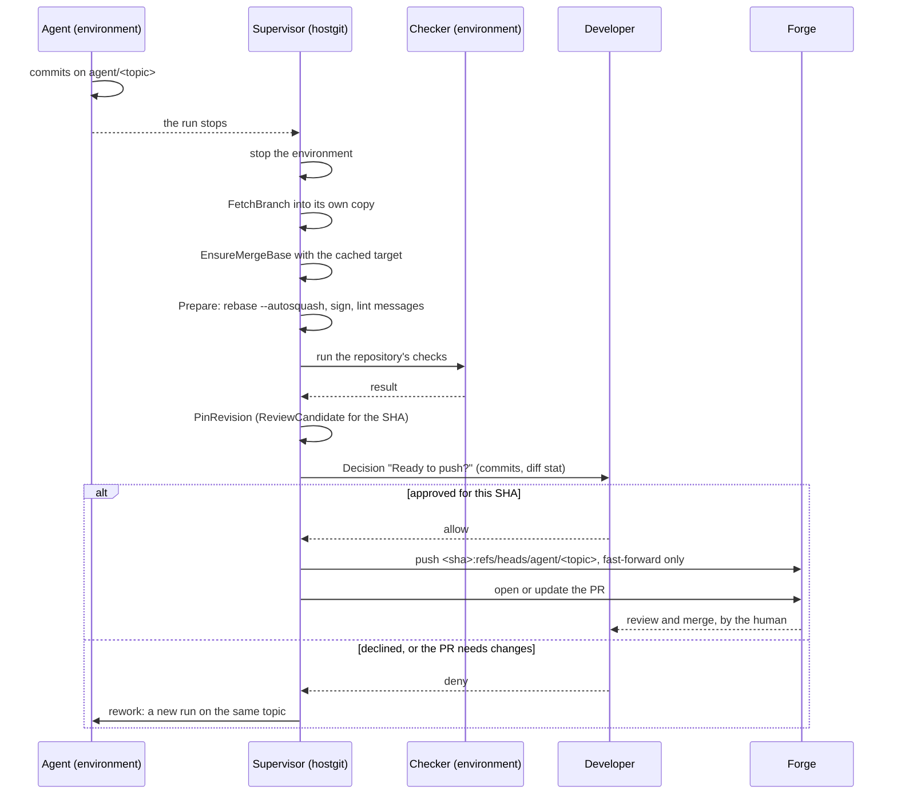

## 4. Domain model

| Object | Responsibility | Lifetime |
| --- | --- | --- |
| Task | Issue, instructions, decisions, progress, results, PR link | Until completed, cancelled or failed |
| Workspace | A folder on the host or an external SSD: its agent clone, the agents' worktrees, the integration branch, tool config and caches (D42) | Created and removed by the human; outlives tasks, runs and environments |
| Agent | A named role in a workspace (for example `docs`, `runtime`): its worktree and branch `agent/<role>`, instructions, permission profile and session (D42) | Until the human removes it; works on many tasks in turn |
| Run | One execution of an agent in an environment | Start, pause, resume, terminate |
| Environment (`env`) | Container or VM backing a workspace; it runs the runs of the workspace's agents at once (D42). A console is an environment without an agent (D43) | Stopped or recreated independently of workspace data |
| **Decision** | A question, approval or review request raised to the human | Until answered |
| **ReviewCandidate** | Task → branch → commit SHA → PR → CI results, keyed by SHA | One per prepared revision: created when cleanup pins the SHA, before the push (§4.5) |
| Event | Append-only record of instructions, observations, decisions, actions | Permanent (audit trail and UI feed) |

### 4.1 State machines

Task, run and environment each get their own small FSM with explicit legal transitions; these are specified before coding.

- **Task** (D13):

    | From | To |
    | --- | --- |
    | `queued` | `running`, `cancelled` |
    | `running` | `awaiting_guidance`, `ready_for_review`, `failed`, `cancelled` |
    | `awaiting_guidance` | `running`, `failed`, `cancelled` |
    | `ready_for_review` | `running` (rework), `completed`, `cancelled` |
    | `completed`, `cancelled`, `failed` | none (terminal) |

    ```mermaid
    stateDiagram-v2
        [*] --> queued
        queued --> running
        queued --> cancelled
        running --> awaiting_guidance
        running --> ready_for_review
        running --> failed
        running --> cancelled
        awaiting_guidance --> running
        awaiting_guidance --> failed
        awaiting_guidance --> cancelled
        ready_for_review --> running: rework
        ready_for_review --> completed
        ready_for_review --> cancelled
        completed --> [*]
        cancelled --> [*]
        failed --> [*]
    ```

    - `awaiting_guidance` is for blocking Decisions raised by a run: a question or a tool approval from a live run, or `auth_expired` or `quota_exhausted` for a paused one (D23). The review Decisions of `ready_for_review` ("Ready to push?", §4.5) leave the task in `ready_for_review`.
    - **Rework** (`ready_for_review → running`) happens when the push is declined or the PR needs changes. It starts a new run on the same workspace and topic.
    - **`completed`** is set when the pushed PR is merged on the forge.
    - **`failed`** is terminal and maps to exit code 10 (§9.2). A failed run does not fail its task: it opens a blocking Decision (retry or cancel). A task fails only when a hard limit ends it (time or cost budget, a lost workspace) or the human answers that Decision with "give up". Both happen while the task is `running` or `awaiting_guidance`. In `ready_for_review` a lost workspace opens a review Decision instead (rework or cancel), so no other state needs a way into `failed` (D21).
    - A run paused by the human leaves its task `running`: pause is a run state. A run paused by `auth_expired` or `quota_exhausted` opens a blocking Decision, which moves the task to `awaiting_guidance` like any blocking Decision raised by the run (D21).
- **Run** (issue #15):

    | From | To |
    | --- | --- |
    | `starting` | `running`, `stopped`, `failed`, `interrupted` |
    | `running` | `paused`, `stopped`, `failed`, `interrupted` |
    | `paused` | `starting` (relaunch), `running` (cooperative pause), `stopped`, `interrupted` |
    | `interrupted` | `starting` (resume), `stopped`, `failed` |
    | `stopped`, `failed` | none (terminal) |

    ```mermaid
    stateDiagram-v2
        [*] --> starting
        starting --> running
        starting --> stopped
        starting --> failed
        starting --> interrupted
        running --> paused
        running --> stopped
        running --> failed
        running --> interrupted
        paused --> starting: relaunch
        paused --> running: cooperative pause
        paused --> stopped
        paused --> interrupted
        interrupted --> starting: resume
        interrupted --> stopped
        interrupted --> failed
        stopped --> [*]
        failed --> [*]
    ```

    - **Pause is a run state.** Pausing never changes the environment (§4.3).
    - **Resuming a paused run.** None of the measured agents has a cooperative pause (D11), so pause is a hard interrupt: the agent process is gone while the run is paused, and resume relaunches it from the session. That is `paused → starting`, like a resume from `interrupted`, so a failed relaunch can end in `failed`. `paused → running` is for an agent that reports cooperative pause, whose process stays alive. If the process of a paused run is lost anyway, the run goes to `interrupted`. Every resume after a pause, a cancel or an interruption starts with a briefing from the supervisor (D27).
    - **`stopped`** is a normal end: the agent finished, or the run was cancelled. **`failed`** is an agent crash, a failed start or a failed resume.
    - **Into `interrupted`:** the reconciler (§5.3) marks a `starting`, `running` or `paused` run `interrupted` when its process or environment is gone: a supervisor or host restart, or a lost environment. Nothing else sets it, and a pending approval is raised again on resume (§4.2).
    - **Out of `interrupted`:** `starting` when the reconciler resumes the agent from its session in a running environment (§4.3); `stopped` when the task is cancelled; `failed` when resuming is impossible or its attempts are used up.
    - **Terminal runs are never reused.** A retry or rework starts a new run on the same workspace and topic (§4.1 task rules).
- **Environment** (issue #15):

    | From | To |
    | --- | --- |
    | `provisioning` | `stopped` (created), `deleted` (provisioning failed or abandoned) |
    | `stopped` | `running`, `deleted` |
    | `running` | `stopped` |
    | `deleted` | none (terminal) |

    ```mermaid
    stateDiagram-v2
        [*] --> provisioning
        provisioning --> stopped: created
        provisioning --> deleted: failed or abandoned
        stopped --> running
        stopped --> deleted
        running --> stopped
        deleted --> [*]
    ```

    - **Start and stop** move between `stopped` and `running`. After a service or host restart every environment is `stopped` (spike #2, §5.3), so the reconciler observes `running → stopped` and starts the ones that should run.
    - **Delete only from `stopped`.** A running environment is stopped first.
    - **Recycling** (§4.3) deletes an environment and provisions a new one, so it is a new Environment with a new ID. An environment is never reprovisioned.
- **Coupling rules** (issue #16). The three machines are not independent; a task aggregate (the task with its runs, their environments and its ReviewCandidates) checks these guards before a change is made:
  - **One live run.** A task has at most one run that is not `stopped` or `failed`, and a run is only created or started (from `paused` or `interrupted`) in an environment that is `running`.
  - **A new run is new.** `StartRun` takes a run that has not started (no state) and a non-empty ID that no run of the task has; a stopped or failed run is never passed back in. It is refused unless the task is `queued`, `running` or `ready_for_review` (rework, §4.1); a `completed`, `cancelled`, `failed` or `awaiting_guidance` task starts no run. Once every guard has passed, `StartRun` moves a `queued` or `ready_for_review` task to `running` in the same change, so a rework run never stops under a `ready_for_review` task; a refused start moves nothing.
  - **Pause never stops the environment.** Pausing a run changes the run only. An environment is not stopped while a run in it is `starting` or `running`; a run is stopped or interrupted first.
  - **`ready_for_review` needs a stopped run and a pinned SHA.** The task's latest run is `stopped` (a `failed` run does not qualify), and a ReviewCandidate exists whose SHA is pinned (§4.5). The current revision is the most recent ReviewCandidate, and it records the run that produced it: it must be the latest run. Only the latest run may pin a revision, so a late pin from an older run cannot become the current one. After rework, a new run that stops without pinning a new commit leaves the task not ready, so the old SHA and its old CI result never carry over.
  - **CI belongs to a SHA.** A pipeline result is recorded on the ReviewCandidate of its own commit. A pass on an earlier SHA never counts for the current revision: where CI is required, `ready_for_review` is refused until the current SHA has passed.
  - **Violations are conflicts.** A broken coupling rule and an illegal transition are reported as a conflict, exit code 5 (§9.2). An unknown run, environment or SHA is "not found", exit code 3.

### 4.2 Decision object

Fields: ID, task, run (empty for a review Decision, which no live run raised), kind (`question | approval | review`), blocking flag, subject, input (untrusted, capped), commit SHA, options, status, created and answered timestamps, deadline, answer, reason and answering actor (issue #17). The inbox, `whr inbox`, notifications and the audit trail hang off it. "Awaiting guidance" is the state a task enters while a blocking Decision raised by a live run is open; review Decisions belong to `ready_for_review` (§4.1).

**Approvals are live and blocking.** Spike #1 showed the pattern with Claude Code: the agent's permission prompt is routed to the supervisor, which opens an `approval` Decision carrying the tool name and a capped copy of its input. The agent stays blocked until a human answers allow or deny, with an optional reason that is passed back to the agent. Rules:

- **Fail closed.** Deny on timeout (the spike used 10 minutes) and when the supervisor is unreachable.
- **Plan approval.** In plan mode the agent's `ExitPlanMode` arrives as an approval whose subject is the plan.
- **Capped input.** Tool inputs in a Decision are capped (the spike used 2,000 characters); the full input stays with the agent. All of it is untrusted data.
- **Status.** `open` becomes `answered`, `expired` (the deadline passed) or `superseded` (the supervisor restarted or the run was paused); each is terminal. Only `answered` with `allow` ever permits anything: an open, expired or superseded approval is a denial.
- **Approval channel transport (D26).** Approvals travel over the agent's stdio control protocol (`--permission-prompt-tool stdio`, `stream-json` in and out) on the runtime's interactive exec channel (`container exec -i`): `control_request` (`can_use_tool`) on stdout, `control_response` (allow or deny) on stdin, matched by `request_id`. An answer for an unknown `request_id` is denied, and open requests are denied when they are superseded (D23). A closed stdin was reported to fail closed without running the tool; a crashed supervisor end and an unanswered request are  (issue #7), so when the channel is lost the supervisor stops the agent with `whr-shim` (D25) and records the request as denied. No guest-to-host network path, no listener and no approval token in the guest.
- **Deadline.** An approval always has one (default 10 minutes). An answer that arrives after it is refused and the Decision expires, so a late "allow" does not count. An approval that has none (a lost value, a damaged row) counts as past it: an answer expires it, and `Allows` is false. The store refuses to write such an approval and refuses to load one. Only a question or a review Decision may have no deadline.
- **A refusal can still change the Decision.** A late answer expires the Decision, and an allow for another commit is recorded as a denial, while both return an error. The store's `RespondDecision` loads, answers and saves in one transaction and saves the change even when the answer is refused, so a refusal is never lost to a rollback. The caller still receives the error (exit code 5).
- **Bad input is a usage error.** A missing actor or time, an answer that is not offered and a malformed new Decision are not conflicts: they exit with code 2 (§9.2). A conflict (code 5) depends on the Decision's state; a usage error does not.
- **Commit SHA.** A review Decision such as "Ready to push?" carries the pinned SHA of its ReviewCandidate (§4.5, §6). An allow is tied to that SHA: an allow given for a different SHA is recorded as a denial, and the supervisor asks `Allows(sha)` against the commit it is about to push, so an approval for an earlier revision never covers a later one.
- **Pause and restart** (D23). A Decision raised by a live run (a question or an approval) is `superseded` when the supervisor restarts or the run is paused: pause is a hard interrupt (D11), so the agent process that asked is gone and could not receive the answer. The reconciler, or the resume, raises a new one when the agent asks again (§5.3). An answer sent to a superseded Decision is refused as a conflict (§9.2, exit code 5). A review Decision belongs to no run, so it survives both, and so do the login and quota questions below: they are raised for a run that is already paused, and nothing waits on them. This is the one restart rule; §4.1 and §5.3 refer to it.
- **Expired auth and quota** (D23). `auth_expired` and `quota_exhausted` are blocking `question` Decisions raised for the paused run, not approvals, because nothing is being permitted. Their options are fixed: for `auth_expired`, "Signed in again, resume" or "Cancel"; for `quota_exhausted`, "Resume now", "Resume at reset" (with the reset time when the agent reports it) or "Cancel". The run stays paused and the task moves to `awaiting_guidance` (§4.1, D21). They have no deadline: waiting is safe, because nothing runs until they are answered.
- **Task state (D13, D23).** Only a blocking Decision raised by a run moves its task to `awaiting_guidance`: a question or approval from a live run, or a login or quota question for a paused one. A review Decision belongs to no run and leaves the task in `ready_for_review`.

### 4.3 Lifecycle rules

- IDE/SSH disconnect does not pause the agent or stop the environment.
- **Detached sessions.** The agent process runs inside the environment under the supervisor with no client attached. Chat is attach and detach over a persistent session, never the owner of the process. Session state (transcript and agent session ID) lives in the workspace, so it survives a supervisor restart and a reattach from another client. The reconciler (§5.3) resumes from that session after a restart.
- A long run can outlive its credentials. Expired auth or an exhausted usage window pauses the run and opens a blocking Decision (§5.2) instead of failing it.
- Pausing lets a human inspect or edit without concurrent agent changes. Human takeover holds an explicit, visible workspace lock (agent vs human); on resume the agent is re-synced with the human's changes.
- Stopping an environment preserves files, logs and agent session state.
- Agent-level checkpoint/resume is distinct from VM suspend and must work on backends without suspend.
- Environments awaiting review may be stopped.
- **Worker recycling** (recreate the environment, keep the workspace) is a first-class lifecycle action because freed guest memory is not returned to macOS.
- Only validated runner × backend pairs may claim resumability.
- **Workspaces and agents (D42, issue #90).** A `Workspace` has a unique name (lowercase letters, digits and `-`, 1 to 40 characters, starting with a letter), a host folder, the repository it was seeded from (`owner/name`), its integration branch (`main` or `develop`) and its environment. An `Agent` has a role (the same character rules, at most 30 characters), unique within its workspace, and gets the branch `agent/<role>` and the worktree `/ws/wt/<role>` inside the environment from it; neither is chosen freely, so a name from a repository's issue or an agent's own output never becomes a path or a ref by itself. A task is assigned to one agent (`Task.AgentID`) and its runs carry the same agent. The model allows several agents per environment, but **the service allows one active run (`starting`, `running` or `paused`) per environment** and refuses a second with the conflict `environment busy` until several agents at once are built (#94). Workspaces and agents are registry records the human creates and removes; they are not part of a task's aggregate and are not changed by task events, so each change is recorded as an audit event in the stream `workspace:<id>` (the event log is keyed by a task or by such a stream). **Creating a workspace** checks the folder (empty, below a workspace root, not inside a git repository; §5.6), seeds the agent clone with `hostgit` (the only time the host runs git there), records the workspace, provisions and starts its environment with the folder mounted read-write at `/ws`, and adds the first agent: `git worktree add` runs inside the environment, never on the host. A failed step takes back what the earlier ones made. **Starting a task on an agent** records the task and its run and checks the one-run rule in one transaction, so two starts cannot both pass; it then starts the agent in its worktree. If the agent cannot be started the run fails into a retry-or-cancel Decision and the environment is free again. One environment serves its workspace's tasks one after the other, so an environment ID can be in several tasks. **Rebasing** an agent's branch onto the integration branch runs `git rebase` in the agent's worktree inside the environment, and is refused while the agent has a starting or running run. A conflict aborts the rebase and is returned with git's report as the conflict `rebase-conflict`; the export (#91) turns it into a Decision on the task. The repository cache and per-task clones of `hostgit` stay until that export replaces the fetch from a stopped environment (§4.5).

### 4.4 Persistence semantics

Decided from spike #2 (Apple Container, issue #2; confirm on other backends):

- **Workspaces live on the host or an external SSD** (D42), outside containers and volumes, and are mounted into their environment read-write. A workspace holds its own agent clone and the agents' worktrees; the human's own repositories are never mounted. Workspaces survive any environment, and one environment serves all agents of a workspace. This replaces per-task clones of a repository cache (D17); the earlier idea of keeping the checkout on a volume stays rejected, and dependency directories follow D39 per worktree.
- **The agent home** (auth directory, session, caches) is one writable named volume per environment. A volume survives stop, start, delete and rebuild.
- **A writable volume is exclusive.** While one container has it read-write, no other container can attach it, not even read-only (the second start fails with "The storage device attachment is invalid"). A rebuild stops the old container before the new one starts. A volume can be shared read-only by several containers.
- **A bind-mounted checkout is slower but usable.** For 5000 files with 300 edits, the first `git status` took 0.3 to 1.1 s on a bind mount against 0.12 s in a volume, later runs about 100 to 130 ms against 75 to 118 ms, `git add` 363 ms against 120 ms, and `commit` 667 ms against 334 ms. Git tuning (untracked cache, `feature.manyFiles`, preloaded index) changed steady-state `status` by almost nothing, because the cost is the cold first stat of every file. Very large repositories were not measured; the cold pass grows with the file count.
- **Dependency directories stay off the bind mount (D39).** Spike #40 measured file-metadata work on a bind mount at 20 to 100 times the cost on a volume for large trees (153 000 files: warm `git status` 8 s against 0.1 s, copying the tree 128 s against 1.5 s; 40 000 small files of a `node_modules` shape: 1.8 s against 0.04 s), while a CPU-bound build took the same time on both. So the untracked trees that hold most of a repository's files are moved to a per-environment volume where the tool reads its location from the environment (`CARGO_TARGET_DIR`, `UV_PROJECT_ENVIRONMENT`), and covered by a volume mounted over the checkout only where it cannot be moved (`node_modules`). A mount point inside the bind mount cannot be removed or renamed in the guest (EBUSY), shows the volume's `lost+found` and hides host files at that path (spike `volume-over-bind`), which is why relocation comes first. The checkout itself stays on the host. Results: [spike #40](../spikes/bind-mount-perf.md).
- **Caches and build output stay on the volume, outside the checkout.** A real build (this repository's `make check`, including golangci-lint and editorconfig-checker compiled from source, 4 CPUs) took 45 s cold and 2.3 s warm with everything on a volume; with only the checkout on a bind mount it was 41 s and 2.7 s, no measurable cost; with the Go caches (about 25,700 module files and 7,800 build-cache files) on the bind mount as well it was 56 s and 4.7 s, about twice as slow warm. The adapter sets `GOMODCACHE`, `GOCACHE` and the package-manager and build-directory equivalents to paths on the environment's volume. A tree with many small files of its own, such as `node_modules`, will behave like the cache case and was not measured.
- **Bind mounts sync both ways at once**, and files the guest root writes appear owned by the host user.
- **The root filesystem is disposable.** It survives stop and start and is lost on delete, so nothing that matters lives there.
- **Mounts are rejected by the adapter, not the runtime.** The runtime accepts any host path. The adapter calls `runtime.CheckMount` before every mount: it resolves symlinks first, then rejects `$HOME` and its parents, `~/.ssh`, other secrets directories and runtime sockets (§7.4), and the conformance suite checks it.
- **Tools are not part of the workspace.** Agent CLIs come from a shared read-only store (§5.6).

Still open: retention and garbage collection of completed tasks, topics and workspaces on the host disk (§8), quotas (a named volume is a sparse image with a virtual size of 512 GiB), and repositories that track more than about 50 000 files, whose `git status` stays slow on a bind mount even with dependencies on a volume (D39, §12).

### 4.5 Topics, checkouts and cleanup before push

A **topic** is one line of work: one branch (`agent/<topic>`) with its own checkout on the host. Several topics are in flight at once, each with its own environment and agent, and the developer can open any checkout in their editor at the same time. That is the worktree idea: parallel topics that are merged and tidied locally before anything leaves the machine.

**Since D42** a topic is an agent's branch in a workspace: each named agent works in its own worktree of the workspace's agent clone, rebases onto the integration branch, and its commits leave as a `git bundle` exported from the running environment (issue #91), not through a fetch from a stopped environment. The import is a fetch of the bundle into a supervisor-owned repository that lacks its objects: `git bundle verify` alone passed a bundle truncated to half its size, while the fetch refused it and left no ref (spike #89). The layout below is the per-task clone of D17 that D42 replaces; it stays until #90 and #91 land, and its cleanup and push rules (prepare, per-SHA approval, push, no rewriting of pushed commits) carry over unchanged.

**Checkout layout** (spike #2, item 9):

- **A per-task clone with a read-only object cache is the default for agent topics.** The supervisor keeps a bare cache per repository on the host. Each topic is a `git clone --shared` of it, with its own `.git` (hooks, config, refs). The cache's objects are mounted read-only at their host path, because the clone's alternates point there, so the agent cannot write the cache and cannot see other topics. New objects go to the clone's own object directory.
- **Clone depth is a per-repository setting, `clone_depth`, default 0 (full history).** A positive value fetches the cache with `--depth` for very large repositories, at a cost measured with git 2.56 on a test repository: `git clone --shared` is silently ignored for a shallow source, so each topic gets its own copy of the shallow history (no alternates; the cache needs no mount); refreshing the cache needs a forced refspec, and a topic takes the refreshed target only with `fetch --update-shallow`; once the target moves further than the depth past the topic's fork point there is no merge base, and a rebase replays the whole shallow history. The supervisor therefore checks for a merge base before a rebase and deepens the cache and the topic (`--deepen`) until it finds one. A partial clone (`--filter=blob:none`) keeps the full history and may be the better option; it was not tested.
- **Worktrees of one repository** (`git worktree`) are the developer's tool on the host for their own parallel topics. They are not handed to agents. A worktree's `.git` file points at the shared repository by host path: mounting only the worktree fails (`not a git repository`), and mounting the shared repository exposes every branch, the shared hooks and config, and the other worktrees' metadata. `git worktree add --relative-paths` makes the pointer work if the mounts keep the relative layout, but the exposure is the same.

**Cleanup before push:**

- **Agents do not push.** The agent commits in its topic's checkout. Nothing leaves the host until a cleanup step has run and been approved.
- **Prepare for push.** The supervisor, on its own copy of the topic (`hostgit`, below), rebases it onto its target, folds attempts into one commit per finished change (fixup and autosquash of unpushed commits only), checks the commit messages (conventional commits and the repository's commit linter), signs the commits with the bot key (§7.7) and runs the repository's checks. Several finished topics can be merged into one integration branch first.
- **Approval.** The result is a ReviewCandidate (a pinned commit SHA) and a Decision, "Ready to push?", that shows the commit list and the diff stat. Approval is per commit SHA, as for any review (§6).
- **Push and PR.** On approval the supervisor pushes the prepared `agent/*` branch with the run's scoped credentials and opens or updates the PR. Merging stays human, on the forge.
- **Pushed commits are never rewritten.** After a push a topic is only extended; rewriting pushed history needs an explicit request. Each revision records the agent's own tip it was prepared from; a follow-up round rebases only the agent's newer commits onto the pushed revision, so the next push is a fast-forward. An agent that rewrote commits it had already handed in is refused rather than guessed at. Publishing needs the task in `ready_for_review` and an approval of its current revision, so a cancelled task or an approval of an earlier revision publishes nothing, and the repository's checks are required.
- **Done or cancelled topics.** The checkout and its branch are removed by the retention rules (§4.4, issue #54) after the push is merged or the topic is cancelled. Unpushed work is kept until the owner discards it.

**Prepare and push in code** (issue #27). The steps above run in this order, on the supervisor's own copy: the environment is stopped (not only the run), the branch is fetched with `FetchBranch`, the target comes from the cache, `EnsureMergeBase` finds a base, and `Prepare` rebases the topic onto the target in a temporary worktree with `--autosquash` (hooks off, the bot as committer, commits signed with the bot key), then lints every commit message and returns the new tip. Running the repository's own checks is not done by `hostgit`: they are the repository's code, so a `Checker` runs them in an environment, never on the host. The tip is pinned (`PinRevision`) and a review Decision "Ready to push?" is raised for that SHA. `Push` sends one `agent/*` branch, fast-forward only, as the exact approved commit (`<sha>:refs/heads/<branch>`), never with force and never tags.



**The editor copy** (issue #59). The developer's editor is never pointed at an agent's checkout: opening it runs planted repository config on the host (VS Code and its git extension, direnv, `.vscode/tasks.json`; threat model T15). `EditorCopy` clones the supervisor's own bare copy of the topic (which `FetchBranch` filled from the stopped environment) into a directory outside the workspace root, with an empty template and none of the agent's config, hooks or alternates, and refreshes it later with a fast-forward only, so the developer's edits are never overwritten. It refuses a destination inside the workspace root, so the agent's checkout cannot be handed out by mistake. The commits themselves are the agent's work and may contain files an editor acts on (`.vscode/tasks.json`, `.envrc`, `.devcontainer`), so the copy lists them and the UI warns before the folder is trusted. The copy is refreshed only from a stopped environment; while the environment runs, the last copy is offered as stale.

**The forge contract** (§10) separates Git transport from the forge API. The adapter is wrapped in a `Guard` that holds the autonomy table: `OpenPR` and `UpdatePR` take an `Approval` (the Decision and the commit SHA) and are refused unless the Decision allows that SHA and the branch at the forge points at it; `Push` needs the same proof; `Merge`, `Tag`, `Release` and `Deploy` are refused whatever the table says (the table's ceilings), and the inner adapter is never called for them. An `Issue` carries the author association for trust tiers (#53), and `VerifyWebhook` takes the request's `http.Header`.

**The host treats every agent-writable checkout as hostile** (§7.4). It never runs plain git there: cleanup and push use hardened git, or fetch the branch into a supervisor-owned repository first.

**`hostgit`** (issue #19) is the only way the host runs git on anything an agent can write:

- **Fetch, then work on the copy.** `FetchBranch` fetches one `agent/*` branch from the agent's checkout into a bare repository the supervisor owns, with no tags, no submodules, object checks on (`fsckObjects`) and only the file transport. Cleanup (rebase, fold, sign) and push run only on that supervisor-owned repository; the agent's checkout is never rebased, committed in or pushed from.
- **Fetch only from a stopped environment.** The checks on a checkout (a real `.git` directory, alternates naming only the cache) and the fetch that follows read the same files at different times. While the environment runs, a process in it, even one the agent left in the background after its run stopped, could rewrite them in between. So the supervisor fetches an agent's branch only after the environment is stopped, not merely the run; preparing for push stops it first.
- **The checkout is checked before git touches it.** `hostgit` knows a workspace root and the read-only caches that agent checkouts may borrow objects from. A checkout is refused unless its resolved path lies under the root, its `.git` is a real directory (not a `gitdir:` file or a symlink, which would redirect git to another host repository), `objects` and `refs` are real directories, there is no `commondir`, and `objects/info/alternates` is absent or names only the listed caches (a regular file, no quoting; `http-alternates` must not exist). An alternates file pointing at another repository would let a commit name that repository's secret blobs by hash, and the next push would send them to the forge. Git is then pointed at the verified `.git` directory explicitly (`GIT_DIR`, with `GIT_CEILING_DIRECTORIES` so it never walks up), and a fetch uses only the file protocol (`GIT_ALLOW_PROTOCOL=file`; every other command allows none). The checks and the fetch run only once the environment is stopped (below); the supervisor enforces that in the push flow (issue #27).
- **No git commands in the agent's tree, except read-only plumbing.** A handle on an agent's checkout (`Untrusted`) accepts only `rev-parse`, `rev-list`, `cat-file`, `for-each-ref`, `ls-tree`, `merge-base` and `show-ref`. Each command has a list of the options it accepts, matched exactly: git accepts an unambiguous prefix of a long option, so a list of refused options is not enough (`--textc` ran a textconv driver). `status`, `add`, `commit`, `checkout`, `diff`, `log -p`, `rebase`, `push` and `fetch` are refused, as are `--textconv` and `--filters`: they can run filters, textconv drivers, hooks or the file-system monitor from the agent's repository config, which no command-line override can list in advance.
- **A hardened floor on every host git command.** Git starts with an empty environment (no `GIT_*` from the host, a minimal `PATH`, an empty `HOME`, no system or global config, no terminal prompt, no optional locks, no replace objects) and `-c` overrides that disable hooks (`core.hooksPath`), the file-system monitor, the pager and editor, credential helpers, signing, submodule recursion, and every transport except `file` for a fetch from an agent.
- **The cache and the topic clone** (issue #45). `Cache` is the bare repository per repository, with the repository's `clone_depth` (default 0). `Refresh` fetches one branch from the forge with the forced refspec `+refs/heads/<b>:refs/heads/<b>`, no tags, objects checked, and `--depth` for a positive depth (an existing shallow cache is made complete with `--unshallow` when the depth is 0). The source is an absolute path or an `https://` URL without credentials; every other scheme (`ssh`, `ext::`, `file://`) and anything that starts with a dash is refused, and an authenticated fetch comes with the forge adapter (issue #27). `CloneTopic` creates the checkout with an empty template (no hooks copied) and the topic branch: with depth 0 it is `git clone --shared`, whose alternates name the cache's `objects` directory, which is the one directory the runtime mounts read-only and the one `hostgit` lists as an allowed cache; with a positive depth it is a `--depth` clone through a `file://` URL, because `--shared` is ignored for a shallow source, so the topic is self-contained and nothing is mounted. A shallow cache with depth 0 configured is refused instead of silently producing a copy.
- **One writer per cache** (issue #67). Every operation on a cache (refresh, deepen, clone, merge-base search, maintenance) runs under a per-cache lock: a mutex shared by every handle of the same path and a file lock (`whr.lock`) for other processes, waited for with the caller's context. Git's own lock files (`shallow.lock`, `packed-refs.lock`, ref locks) are never left to block the next refresh: while the cache lock is held no other supervisor process runs git on it, so a lock file found then is stale and is removed first. Three parallel shallow refreshes had failed 40 times in 60 on `shallow.lock` without it.
- **A topic keeps its objects.** After a force-push on the forge the cache drops the old tip, and a garbage collection would expire it, corrupting a `--shared` topic cloned from it. `CloneTopic` therefore pins the commit it cloned with a keep ref (`refs/whr/keep/<id>`), `ReleaseTopic` removes it when the topic is removed (§4.4), the cache sets `gc.pruneExpire=never`, and `Maintain` (the only explicit maintenance; background gc is off) runs under the lock.
- **Names map to directories by a strict rule.** `CachePath(repo)` accepts only `owner/name` made of ASCII letters, digits, `.`, `_` and `-` (each part starting with a letter or digit, at most 100 characters), lowercases it, and appends a short hash, so `Foo/x` and `foo/x` are one cache on a case-insensitive disk and no name, path separator or Unicode form can leave the cache root. A cache path must be absolute and inside the cache root when one is set (`WithCacheRoot`), a relative path is refused instead of being created under `/`, and a local source inside the workspace root (agent-writable) is refused.
- **Merge base before a rebase.** `EnsureMergeBase` looks for a merge base between the target and the topic in the supervisor's copy. While there is none and either side is shallow it deepens the cache (`fetch --deepen`) and then the copy (`fetch --update-shallow --deepen`) by a step, up to a limit, and reports `ErrNoMergeBase` when the limit is reached or both sides are complete, so the caller opens a Decision instead of rebasing blindly. `FetchBranch` takes `--update-shallow`, because a shallow topic would otherwise not be fetched at all.
- **Tested.** Tests plant a hook, `core.fsmonitor`, `core.sshCommand`, `core.pager`, a clean and smudge filter and `uploadpack.packObjectsHook` in an agent checkout. Control runs of plain git prove each one fires; none runs through `hostgit`.
